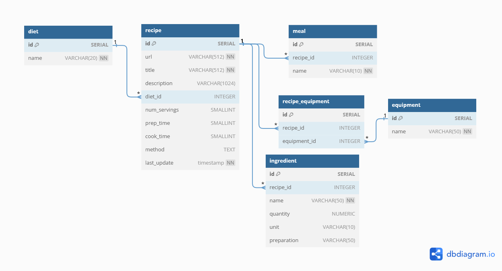

# the_doctors_kitchen_project
Check out the Streamlit app: https://finns-recipe-dashboard.streamlit.app/
---
[The Doctor's Kitchen](https://thedoctorskitchen.com/) is a recipe website created by Dr. Rupy Aujla. The site aims to provide recipes which have evidence-based health benefits. As a fun side project, I thought I would scrape and analyse the recipes on this website. The goals for this project are:
- Find the most and least used ingredients
- Find what cooking equipment each recipe uses, this isn't listed nicely in each recipe.
- Be able to search and filter recipes by ingredient, equipment, time to cook, and more.

## Solution
Using Python, I scraped The Doctor's Kitchen to get recipe data such as ingredients, equipment used, time to cook, etc. This data is stored in a PostgreSQL database hosted with Neon.tech. Then, to visualise and use the data I created a Streamlit app. Through this app one can explore this data through a dashboard, and search for recipes by ingredient. All results link back to their respective page on The Doctor's Kitchen.

The folder [scraper](scraper/) contains the code used to scrape and process recipe data from the website.

The folder [streamlit_app](streamlit_app/) contains streamlist app code. Check out the app [here](https://finns-recipe-dashboard.streamlit.app/).

This project is not endorsed by The Doctor's Kitchen.

## Database Schema

